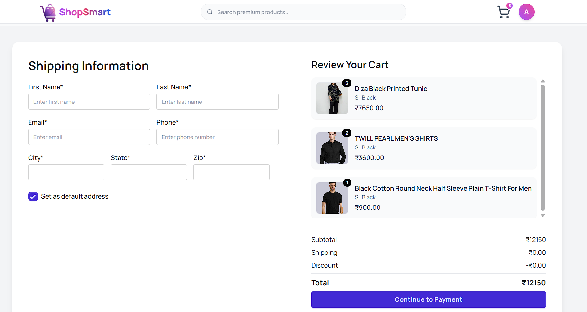
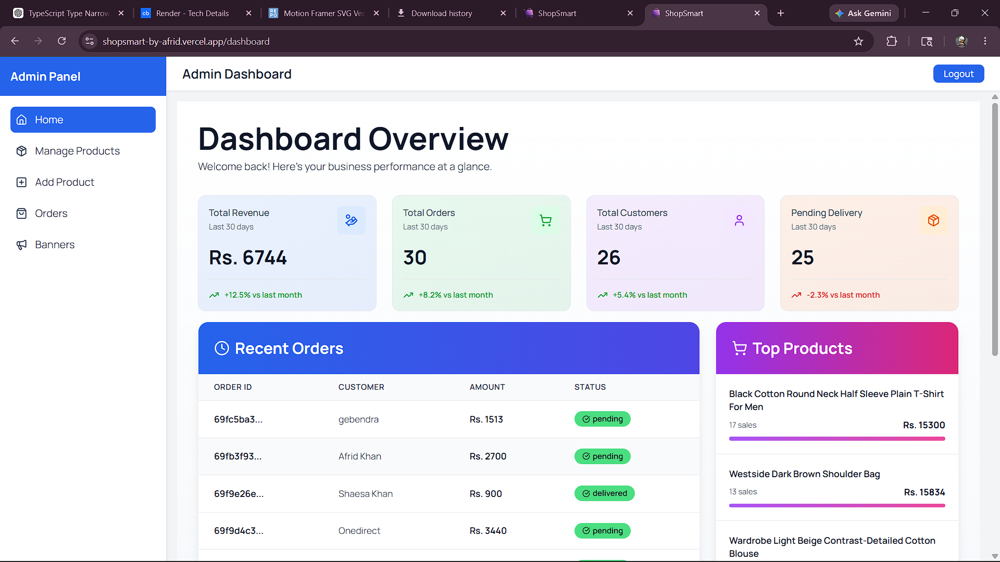

# 🛒 ShopSmart – Full Stack E-commerce Web Application

## 📌 Description
ShopSmart is a fully functional full-stack e-commerce web application built using the MERN stack.  
It provides users with a seamless shopping experience including product browsing, cart management, authentication,Banner management, and order processing with a responsive and modern UI.

---

## 🚀 Tech Stack
- **Frontend:** React.js, Tailwind CSS, DaisyUI, Framer Motion  
- **State Management:** Redux Toolkit (RTK Query)  
- **Backend:** Node.js, Express.js  
- **Database:** MongoDB  
- **Language:** JavaScript  

---

## ✨ Features
- User Authentication (Register / Login)
- Product browsing with categories
- Admin Panel for Order, Banner Product user controlling
- Add to cart / remove from cart
- Order placement system
- Responsive UI for all devices
- Smooth animations using Framer Motion
- Optimized API calls using RTK Query

---

## 🌐 Live Demo
👉 https://your-live-link-here.vercel.app

---

## 📸 Screenshots
  ### Home Page & Banners
   

 ### Admin Pannel & Checkout Page
   

 

---

## ⚙️ Installation

```bash
# Clone the repository
git clone https://github.com/khanafrid07/shopsmart-web.git

# Install dependencies
npm install

# Start development server
npm run dev
